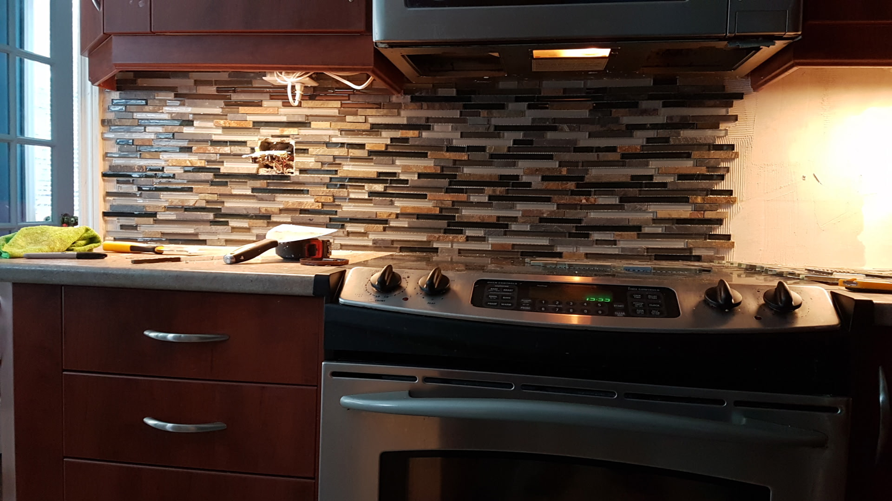

# TO DO List for the pictures

# Edit this -> 

                        
                        

                            <h2>Always Open to Work</h2>
                            Something about being open to your home

## LEFT OFF EDITING THE BEFORE AND AFTER PIC NAMES
